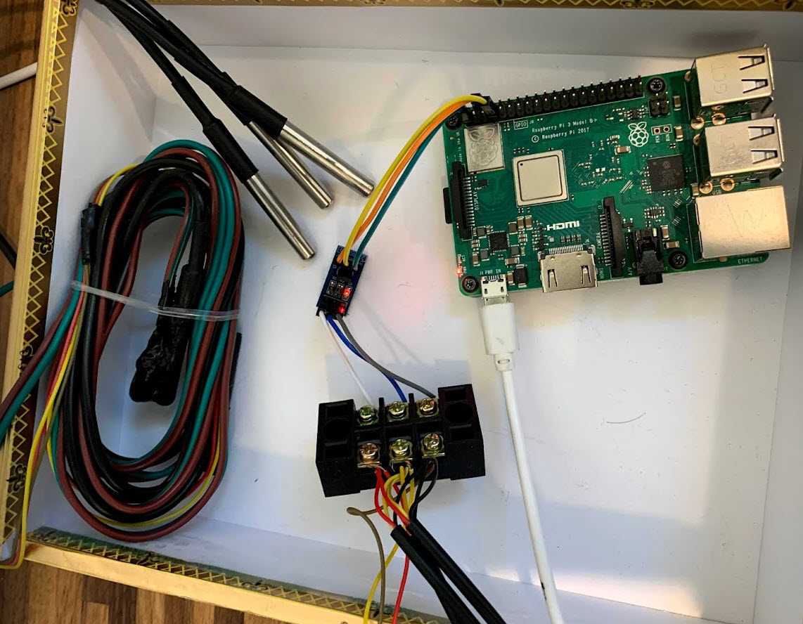

## Getting a first one-wire reading

## Setup the raspberry pi

I'm doing this on a fresh Raspbian Lite install on a 64gb SD card, running in a Pi3B. 

Perform an apt-get update and upgrade, enable ssh, and enable one-wire in the raspi-config.  
```
sudo apt update -y  
sudo apt upgrae -y 
sudo raspi-config  #This launches the raspi config, inside here you enable SSH and turn on one-wire. 
```


Gonna need some various python packages for reading the DS18B20 and for offering prometheus formatted metrics.  Install those:
```
sudo apt-get install python3-pip
pip3 install DS18B20
pip3 install prometheus_client

```

### Physical Setup:

Ok, so now that we've got the Pi set up, and those modules installed we can actually connect up our temperature sensors. Really we can read any "one-wire" compatible accesory - but in this case we're talking multiple DS18B20 temp sensors. 

The one-wire bus requires that the control signal be pulled high so the master device can pull it low to ask for data, and the slave device can pull it low to give the data. This allows you to have multiple 1-wire devices on the same "one wire".  This is accomplished by bridging a 4.7K Ohm resistor from VCC. 

Each DS18B20 will end up connected to:
```
-VCC (pin 1 3v3 power)
-GND (pin 6)
-GPIO 4 (pin 7) 
```


Alternatively, if you don't want to wire  up the resistor yourself I have found and purchased small DS18B20 PCB boards that have one sensor on them and they have little connectors allowing for adding of more DS18B20 sensors


With these, I'm able to use a standard set of jumper wires from the pi to the little PCB, then I ran some wires from the left side to a 3 conductor screw terminal and connected 5 more DS18B20 sensors up to that. 

So at this point, we've got the raspberry pi wired up with a series of DS18B20 sensors, and we're ready to start reading them and doing something with that data!

Here's what mine looked like at this stage:



### Reading the sensors:

SSH into your pi, and we're gonna set up a service to make readings of the temperature sensors and offer those readings as prometheus metrics. 

Due to the nature of reading multiple sensors from a single wire, we have to have a way to identify the reading from each sensor so they have serial numbers.  The first thing you need to do, which will also validate that your wiring is correct, is get the serial numbers from your DS18B20 sensors so they can go into the temperature reading program.  You can get the serial numbers of all recognized one wire devices by listing out the directory `/sys/bus/w1/devices`

```
pi@raspberrypi:/sys/bus/w1/devices $ cd /sys/bus/w1/devices
pi@raspberrypi:/sys/bus/w1/devices $ ls -l
total 0
lrwxrwxrwx 1 root root 0 Sep 15 02:58 28-01192cab6914 -> ../../../devices/w1_bus_master1/28-01192cab6914
lrwxrwxrwx 1 root root 0 Sep 15 03:24 28-031097944ab9 -> ../../../devices/w1_bus_master1/28-031097944ab9
lrwxrwxrwx 1 root root 0 Sep 15 03:26 28-03139794118a -> ../../../devices/w1_bus_master1/28-03139794118a
lrwxrwxrwx 1 root root 0 Sep 15 03:24 28-0417b2cac8ff -> ../../../devices/w1_bus_master1/28-0417b2cac8ff
lrwxrwxrwx 1 root root 0 Sep 15 03:24 28-0517b14708ff -> ../../../devices/w1_bus_master1/28-0517b14708ff
lrwxrwxrwx 1 root root 0 Sep 15 02:55 w1_bus_master1 -> ../../../devices/w1_bus_master1
```

Now that we have the serial number of each one-wire DS18B20 sensor, we can introduce that into the python program below that 

```
#!/usr/bin/env python3

# Prometheus Exporter for DS18B20 temp sensors connected to a raspberry pi via one wire
# Usage: ./tempexporter.py 

import time
from ds18b20 import DS18B20
from prometheus_client import Gauge, start_http_server

# Create empty metrics variable for the temp off each sensor.
ds18b20_1_temperature_celsius = Gauge('ds18b20_1_temperature_celsius', "Temperature in celsius provided by the first DS18B20 sensor")
ds18b20_2_temperature_celsius = Gauge('ds18b20_2_temperature_celsius', "Temperature in celsius provided by the second DS18B20 sensor")
ds18b20_3_temperature_celsius = Gauge('ds18b20_3_temperature_celsius', "Temperature in celsius provided by the third DS18B20 sensor")
ds18b20_4_temperature_celsius = Gauge('ds18b20_4_temperature_celsius', "Temperature in celsius provided by the fourth DS18B20 sensor")
ds18b20_5_temperature_celsius = Gauge('ds18b20_5_temperature_celsius', "Temperature in celsius provided by the fifth DS18B20 sensor")

sensor1 = DS18B20("0517b14708ff")
sensor2 = DS18B20("0417b2cac8ff")
sensor3 = DS18B20("031097944ab9")
sensor4 = DS18B20("03139794118a")
sensor5 = DS18B20("01192cab6914")

def read_sensor():
  ds18b20_1_temperature_celsius.set(sensor1.get_temperature())

def read_sensor2():
  ds18b20_2_temperature_celsius.set(sensor2.get_temperature())

def read_sensor3():
  ds18b20_3_temperature_celsius.set(sensor3.get_temperature())

def read_sensor4():
  ds18b20_4_temperature_celsius.set(sensor4.get_temperature())

def read_sensor5():
  ds18b20_5_temperature_celsius.set(sensor5.get_temperature())

#main function to start the prometheus metrics server and then read each sensor every 10 seconds. 
def main():
    start_http_server(8001)

    while True:
        read_sensor()
        read_sensor2()
        read_sensor3() 
        read_sensor4()
        read_sensor5()
        time.sleep(10)

main()
```

Now, we could just run this script from the command line, but since we want this solution to be robust (and for the temperature reporting to resume even if there is a reboot of the pi) we'll install it as a systemd service so create a tempexporter service file: 

`sudo vi /etc/systemd/system/tempexporter.service` 

```
[Unit]
Description=Temp Exporter
Wants=network-online.target
After=network-online.target

[Service]
User=pi
ExecStart=/home/pi/tempexporter.py

[Install]
WantedBy=default.target
```

Then, in service lingo we need to reload the daemon, enable the service, and start the service. 

```
pi@raspberrypi:~ $ sudo systemctl daemon-reload
pi@raspberrypi:~ $ sudo systemctl enable tempexporter
Created symlink /etc/systemd/system/default.target.wants/tempexporter.service → /etc/systemd/system/tempexporter.service.
pi@raspberrypi:~ 

pi@raspberrypi:~ $ sudo systemctl start tempexporter
pi@raspberrypi:~ $ sudo systemctl status tempexporter
● tempexporter.service - Temp Exporter
   Loaded: loaded (/etc/systemd/system/tempexporter.service; enabled; vendor preset: enabled)
   Active: active (running) since Sat 2021-09-18 19:49:13 BST; 6s ago
 Main PID: 7207 (python3)
    Tasks: 2 (limit: 2200)
   Memory: 7.0M
   CGroup: /system.slice/tempexporter.service
           └─7207 python3 /home/pi/tempexporter.py

```

That is it - the code should be taking readings from your sensors every 10 seconds, and making them avaialble as prometheus metrics.  You can verify this by connecting in a browser to the IP address of the raspberry pi on port 8001/ 

Do an `ip a` command in the terminal to see your pi's IP address.  Then plug that into your browser with the :8001 after the IP address, and you'll see something like this:


As you can see you get a number of Python specific metrics - but the ones we care about and declared are on the bottom - and have temperatures reporting. 


